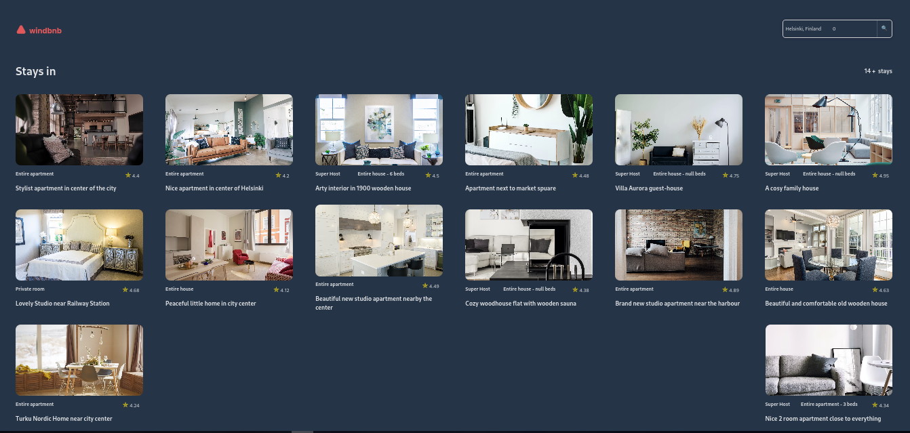

<!-- Please update value in the {}  -->

<h1 align="center">Windbnb</h1>

<div align="center">
   Solution for a challenge from  <a href="http://devchallenges.io" target="_blank">Devchallenges.io</a>.
</div>

<div align="center">
  <h3>
    <a href="https://windbnb-950fa8.netlify.app/">
      Demo
    </a>
    <span> | </span>
    <a href="https://github.com/xabi1000/windbnb">
      Code
    </a>
  </h3>
</div>

## Table of Contents

- [Overview](#overview)
- [Built With](#built-with)
- [Features](#features)
- [How to use](#how-to-use)

## Overview



I liked the challenge in general, except having two inputs that do the same task, one in the main page and another one in the hidden component, made me lose some time because I didn't find a clear logic, so I had to change it.

In this challenge I have learned to understand better how is the reactivity and how to pass data between components in svelte.

### Built With

- [SVELTE](https://svelte.dev/)
- [DEV-DOC](https://devdocs.io/svelte/)

## Features

- A simple application to filter lodging according to the city or the country.
- The application is fully responsive.
- Dark and light mode according to the user's device settings

## How To Use

<!-- Example: -->

To clone and run this application, you'll need [Git](https://git-scm.com) and [Node.js](https://nodejs.org/en/download/) (which comes with [pnpm](https://pnpm.io/)) installed on your computer. From your command line:

```bash
# Clone this repository
$ git clone https://github.com/xabi1000/windbnb

# Install dependencies
$ pnpm install

# Run the app
$ pnpm run dev
```
